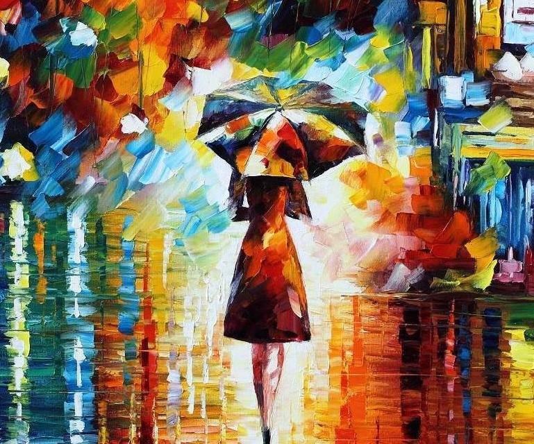

# fast-neural-style :city_sunrise: :rocket:

> If you want to show original Pytorch `Fast-Neural-Style` Exmpale, this is the [Original Repo](https://github.com/pytorch/examples/tree/master/fast_neural_style)


# Introduction

기존의 `Pytorch` [example](https://github.com/pytorch/examples) 레포지터리의 [fast_neural_style](https://github.com/pytorch/examples/tree/master/fast_neural_style)는 [Perceptual Losses for Real-Time Style Transfer and Super-Resolution](https://arxiv.org/abs/1603.08155)를 구현해놓았습니다. 다만 CLI 환경에서 사용되고, `argparse`로 인자들을 넘겨주기 때문에, 인자의 수정이나 사용성 측면에서 불편함을 느꼈습니다. 

그래서 코드를 Python의 **Package**로 리팩토링 하였으며, 인자를 받는 `HyperParameter` 클래스도 추가하였습니다.  

This repository contains a pytorch implementation of an algorithm for artistic style transfer. The algorithm can be used to mix the content of an image with the style of another image. For example, here is a photograph of a door arch rendered in the style of a stained glass painting.

The model uses the method described in [Perceptual Losses for Real-Time Style Transfer and Super-Resolution](https://arxiv.org/abs/1603.08155) along with [Instance Normalization](https://arxiv.org/pdf/1607.08022.pdf). The saved-models for examples shown in the README can be downloaded from [here](https://www.dropbox.com/s/lrvwfehqdcxoza8/saved_models.zip?dl=0).

<p align="center">
    
    
    
</p>


## Usage

### `HyperParameter` calss

```python
class HyperParameter:
  def __init__(self, command, cuda, param_dict):
    # Code

  def set_train_parameter(self, param_dict):
    # Code
    
    def set_eval_parameter(self, param_dict):
      # Code
```

* `__init__`: 어떤 함수를 쓰는지, GPU를 사용하는지 그리고 인자들의 dictionary를 받습니다. 
* `set_train_parameter`: train을 할 경우, ***param_dict***를 넘겨받습니다.
* `set_eval_parameter`: eval을 할 경우, ***param_dict***를 넘겨받습니다.

설정되지 않은 값 들은 default 값으로 설정됩니다. 

> [코드](https://github.com/sanghoho/Fast-Neural-Style-Transfer-Pytorch/tree/master/neural_style/core/neural_style.py)의 `HyperParameter` class 참고

### Stylize image
```python
from ParentDir.core import neural_style

### For Evaluation
param_dict = {
    "content_image": "/path/to/content.jpg",
    "output_image": "/path/to/output.jpg",
    "model": "/path/to/model/checkpoint.pth or mod.model"
}

cuda = 1 # True

param = neural_style.HyperParameter("eval", cuda, param_dict)
neural_style.stylize(param)
```


학습 중 얻을 수 있는 **checkpoint**의 `.pth` 파일이나, 학습이 모두 끝난 뒤 얻을 수 있는 `.model` 파일을 지정해서 학습된 스타일로 **content image**를 변환시켜줍니다. 

### Train model
```python
from ParentDir.core import neural_style

### For Train
param_dict = {
    # "transfer_learning": 1,
    # "checkpoint_model_dir": "/path/to/checkpoint/",

    "dataset": "/path/to/COCO",
    "style_image": "/path/to/style.jpg",
    "save_model_dir": "/path/to/save/"

}

cuda = 1 # True

param = neural_style.HyperParameter("train", cuda, param_dict)
neural_style.stylize(param)
```

train을 하는데, 이전 학습에서 이어서 하고 싶은 경우 **transfer_learing** 인자를 1로 하고, checkpoint 폴더를 지정해두면 이어서 진행합니다.  


I used COCO 2014 Training images dataset [80K/13GB] [(download)](http://mscoco.org/dataset/#download).

* `--style-image`: path to style-image.
* `--save-model-dir`: path to folder where trained model will be saved.
* `--cuda`: set it to 1 for running on GPU, 0 for CPU.

Refer to ``neural_style/neural_style.py`` for other command line arguments. For training new models you might have to tune the values of `--content-weight` and `--style-weight`. The mosaic style model shown above was trained with `--content-weight 1e5` and `--style-weight 1e10`. The remaining 3 models were also trained with similar order of weight parameters with slight variation in the `--style-weight` (`5e10` or `1e11`).

## Requirements
The program is written in Python, and uses [pytorch](http://pytorch.org/), [scipy](https://www.scipy.org). A GPU is not necessary, but can provide a significant speed up especially for training a new model. Regular sized images can be styled on a laptop or desktop using saved models.

## Models

Models for the examples shown below can be downloaded from [here](https://www.dropbox.com/s/lrvwfehqdcxoza8/saved_models.zip?dl=0) or by running the script ``download_saved_models.py``.

<div align='center'>
  		
</div>

<div align='center'>
  
  
  
  
  <br>
  
  
  
  
</div>
